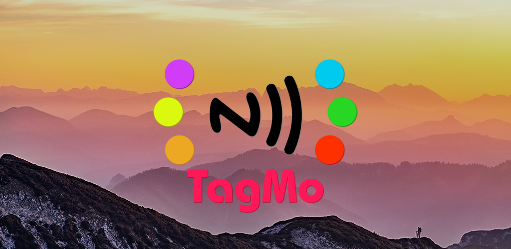

  

TagMo is an Android NTAG215, Power Tag, N2 Elite, & Flask content manager for 3DS, WiiU, and Switch
  
To contribute, please address PRs to the <a href="https://github.com/HiddenRamblings/TagMo/tree/conversion">conversion</a> branch. Thank you.
 

## [Instructions](https://tagmo.gitlab.io/)

## [Reporting Issues](https://github.com/HiddenRamblings/TagMo/wiki#reporting-issues)

## [Code of Conduct](https://github.com/HiddenRamblings/TagMo/blob/master/CODE_OF_CONDUCT.md)

## [Contributors](https://github.com/HiddenRamblings/TagMo/graphs/contributors)

Additional thanks go out to (alphabetically):

### Hardware
* Catflap62 - N2 Elite
* withgallantry - [Bluup Flask](https://www.bluuplabs.com/flask/)

### Miscellaneous
* \_Tim\_ - [DIY amiibo cards](https://gbatemp.net/threads/diy-amiibo-cards.406978/)
* Supercool330 - [Encryption help](https://gbatemp.net/search/2757547/)

### Source
* hax0karti - [Amiibo Generator For Wumiibo](https://github.com/hax0kartik/amiibo-generator)
* Falco20019 - [libamiibo](https://github.com/Falco20019/libamiibo)
* N3evin - [AmiiboAPI](https://github.com/N3evin/AmiiboAPI)
* socram8888 - [amiitool](https://github.com/socram8888/amiitool)

##

###
*TagMo is not affiliated, associated, authorized, endorsed by, or in any way connected with Nintendo. amiibo is a registered trademark of Nintendo. No official resources are included in this project. Files created with this project are not intended for sale or distribution. This project is for educational and archival purposes only.*
